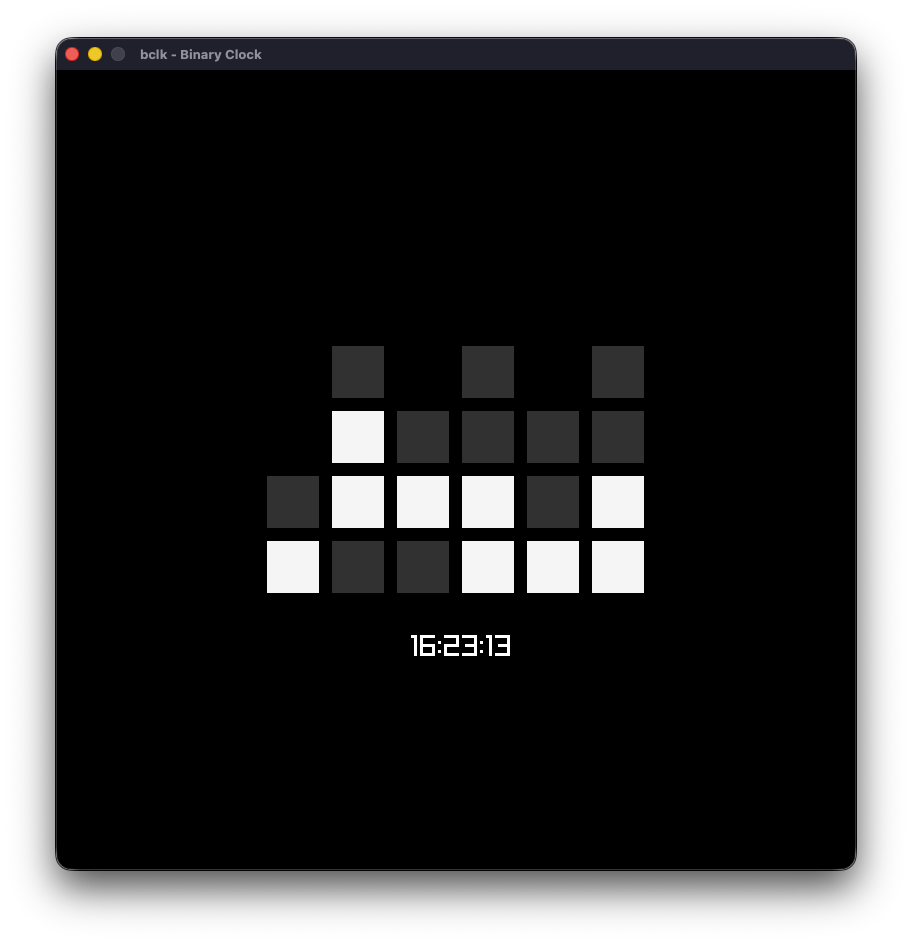

# bclk

Binary Clock for Desktop.
If you don't know how to read it, please check [wikipedia](https://en.wikipedia.org/wiki/Binary_clock).



## Build and Run

```bash
git clone git@github.com:joaoofreitas/bclk.git
cd bclk
zig build run
```

## References
- https://ziglang.org/documentation/0.16.0/
- https://zig.guide
- https://github.com/raylib-zig/raylib-zig
- https://github.com/raysan5/raylib
- https://binaryclock.net/
